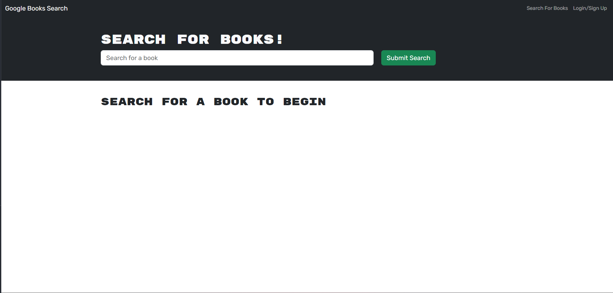

# Social Media NoSQL Backend

## Description

Link to deployed application: [https://graphql-bookapp-meanbean87-109768b76b6e.herokuapp.com/](https://graphql-bookapp-meanbean87-109768b76b6e.herokuapp.com/)

This application was an assignment to convert restful routes to graphQL routes, using Apollo. This application was given in a "working state" and the student was tasked with converting the working state to utilize graphQL with Apollo for routing, and JWT for authentication.

This application was completed using source code from UCB Extension.

Landing Page Example:



## Installation

For Development:

1. Clone or fork the repository from "git@github.com:MeanBean87/graphql-backend.git"
2. Navigate to the root directory of the project using CLI.
3. Open in the code editor of your choice. ie vs-code - optional.
4. Install node modules using "npm install" in either CLI or integrated terminal - vs code.
5. Start the server with "npm run develop" - uses nodemon + hmr.

**Mongo DB and Node.js will need to be installed by the user before installing Node dependencies.**

Node can be installed directly from [https://nodejs.org/en](https://nodejs.org/en).

MongoDB can be installed directly from [https://www.mongodb.com/docs/manual/tutorial/install-mongodb-on-windows/](https://www.mongodb.com/docs/manual/tutorial/install-mongodb-on-windows/)

## Usage

1. Navigate to the deployed page by clicking this link: [https://graphql-bookapp-meanbean87-109768b76b6e.herokuapp.com/](https://graphql-bookapp-meanbean87-109768b76b6e.herokuapp.com/).
2. Sign-up and/or Login using the link on the nav bar.
3. Search for a book by title in the onscreen search bar.
4. Click the button in the books container/card to save the book.
5. Click the link on the navbar to view saved books.
6. If desired delete the saved book and it will no longer be saved to the user.

## Code Highlights

#### Back-end Resolvers:

```js
const { GraphQLError } = require("graphql");
const { User } = require("../models");
const { signToken } = require("../utils/auth");

const resolvers = {
  // Query declarations.
  Query: {
    me: async (parent, args, context) => {
      if (context.user) {
        const userData = await User.findOne({ _id: context.user._id }).select(
          "-__v -password"
        );
        return userData;
      }

      throw new GraphQLError("You must be logged in!", {
        extensions: {
          code: "UNAUTHENTICATED",
        },
      });
    },
  },

  // Mutation declarations.
  Mutation: {
    //addUser mutation
    addUser: async (parent, args) => {
      const user = await User.create(args);
      console.log(user);

      const token = signToken(user);
      return { token, user };
    },

    //login mutation
    login: async (parent, { email, password }) => {
      const user = await User.findOne({ email });

      if (!user) {
        throw new GraphQLError("User Not Found", {
          extensions: {
            code: "UNAUTHENTICATED",
          },
        });
      }

      const correctPw = await user.isCorrectPassword(password);

      if (!correctPw) {
        throw new GraphQLError("Incorrect Password", {
          extensions: {
            code: "UNAUTHENTICATED",
          },
        });
      }

      const token = signToken(user);
      return { token, user };
    },

    //saveBook mutation
    saveBook: async (parent, { input }, context) => {
      if (context.user) {
        const updatedUser = await User.findByIdAndUpdate(
          { _id: context.user._id },
          { $addToSet: { savedBooks: input } },
          { new: true }
        );
        return updatedUser;
      }
      throw new GraphQLError("You must be logged in!", {
        extensions: {
          code: "UNAUTHENTICATED",
        },
      });
    },

    //deleteBook mutation
    deleteBook: async (parent, { bookId }, context) => {
      if (context.user) {
        const updatedUser = await User.findOneAndUpdate(
          { _id: context.user._id },
          { $pull: { savedBooks: { bookId: bookId } } },
          { new: true }
        );
        return updatedUser;
      }
      throw new GraphQLError("You must be logged in!", {
        extensions: {
          code: "UNAUTHENTICATED",
        },
      });
    },
  },
};

module.exports = resolvers;

```

#### Front-end Mutations:

```js
import { gql } from "@apollo/client";

// ADD_USER will execute the addUser mutation.
export const ADD_USER = gql`
  mutation addUser($username: String!, $email: String!, $password: String!) {
    addUser(username: $username, email: $email, password: $password) {
      token
      user {
        _id
        username
        email
      }
    }
  }
`;

// LOGIN_USER will execute the loginUser mutation.
export const LOGIN_USER = gql`
  mutation login($email: String!, $password: String!) {
    login(email: $email, password: $password) {
      token
      user {
        _id
        username
        email
      }
    }
  }
`;

// SAVE_BOOK will execute the saveBook mutation.
export const SAVE_BOOK = gql`
  mutation saveBook($input: BookInput) {
    saveBook(input: $input) {
      _id
      username
      email
      bookCount
      savedBooks {
        bookId
        authors
        image
        link
        title
        description
      }
    }
  }
`;

// DELETE_BOOK will execute the deleteBook mutation.
export const DELETE_BOOK = gql`
  mutation deleteBook($bookId: ID!) {
    deleteBook(bookId: $bookId) {
      _id
      username
      email
      bookCount
      savedBooks {
        bookId
        authors
        description
        title
        image
        link
      }
    }
  }
`;

```

## Learning Points

Converting REST routes to GraphQL routes using Apollo.

## Badges

[](https://img.shields.io/badge/Node%20js-339933?style=for-the-badge&logo=nodedotjs&logoColor=white) [](https://img.shields.io/badge/JavaScript-323330?style=for-the-badge&logo=javascript&logoColor=F7DF1E) [](https://img.shields.io/badge/MongoDB-4EA94B?style=for-the-badge&logo=mongodb&logoColor=white)      

## Author

Michael Mattingly

* [GitHub](https://github.com/MeanBean87)
* [LinkedIn](https://www.linkedin.com/in/michael-mattingly-5580b1280/)

This project was created with source code provided from UC Berkeley Extension.

This project uses the following packages:

* Node.js - [https://nodejs.org/en](https://nodejs.org/en)
* Express - [http://expressjs.com/](http://expressjs.com/)
* MongoDB - [https://www.mongodb.com/](https://www.mongodb.com/)
* Mongoose - [https://mongoosejs.com/](https://mongoosejs.com/)
* Apollo - [https://www.apollographql.com/](https://www.apollographql.com/)
* GraphQL - [https://graphql.org/](https://graphql.org/)
* React - [https://react.dev/](https://react.dev/)
* React Router - [https://reactrouter.com/en/main](https://reactrouter.com/en/main)
* JWT - [https://jwt.io/](https://jwt.io/)

## License

This project is licensed under the [MIT License](https://github.com/MeanBean87/readme-generator/blob/main/LICENSE). Please refer to the LICENSE file for more details.
